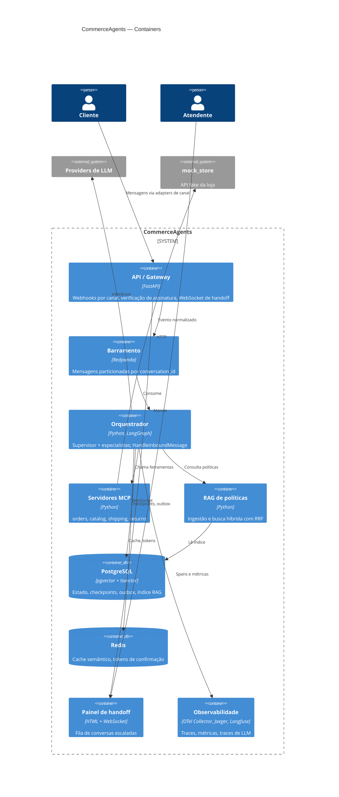

# C4 — Containers

```mermaid
C4Container
    title CommerceAgents — Containers
    Person(cliente, "Cliente")
    Person(atendente, "Atendente")
    System_Ext(llm, "Providers de LLM")
    System_Boundary(ca, "CommerceAgents") {
        Container(api, "API / Gateway", "FastAPI", "Webhooks por canal, verificação de assinatura, WebSocket de handoff")
        Container(bus, "Barramento", "Redpanda", "Mensagens particionadas por conversation_id")
        Container(worker, "Orquestrador", "Python, LangGraph", "Supervisor + especialistas; HandleInboundMessage")
        Container(mcp, "Servidores MCP", "Python", "orders, catalog, shipping, returns")
        Container(rag, "RAG de políticas", "Python", "Ingestão e busca híbrida com RRF")
        ContainerDb(pg, "PostgreSQL", "pgvector + tsvector", "Estado, checkpoints, outbox, índice RAG")
        ContainerDb(redis, "Redis", "", "Cache semântico, tokens de confirmação")
        Container(painel, "Painel de handoff", "HTML + WebSocket", "Fila de conversas escaladas")
        Container(obs, "Observabilidade", "OTel Collector, Jaeger, Langfuse", "Traces, métricas, traces de LLM")
    }
    System_Ext(loja, "mock_store", "API fake da loja")
    Rel(cliente, api, "Mensagens via adapters de canal")
    Rel(api, bus, "Evento normalizado")
    Rel(bus, worker, "Consome")
    Rel(worker, mcp, "Chama ferramentas")
    Rel(mcp, loja, "HTTP")
    Rel(worker, rag, "Consulta políticas")
    Rel(worker, pg, "Checkpoints, outbox")
    Rel(rag, pg, "Lê índice")
    Rel(worker, redis, "Cache, tokens")
    Rel(worker, llm, "Inferência")
    Rel(api, painel, "WebSocket")
    Rel(atendente, painel, "Atende")
    Rel(worker, obs, "Spans e métricas")
```
