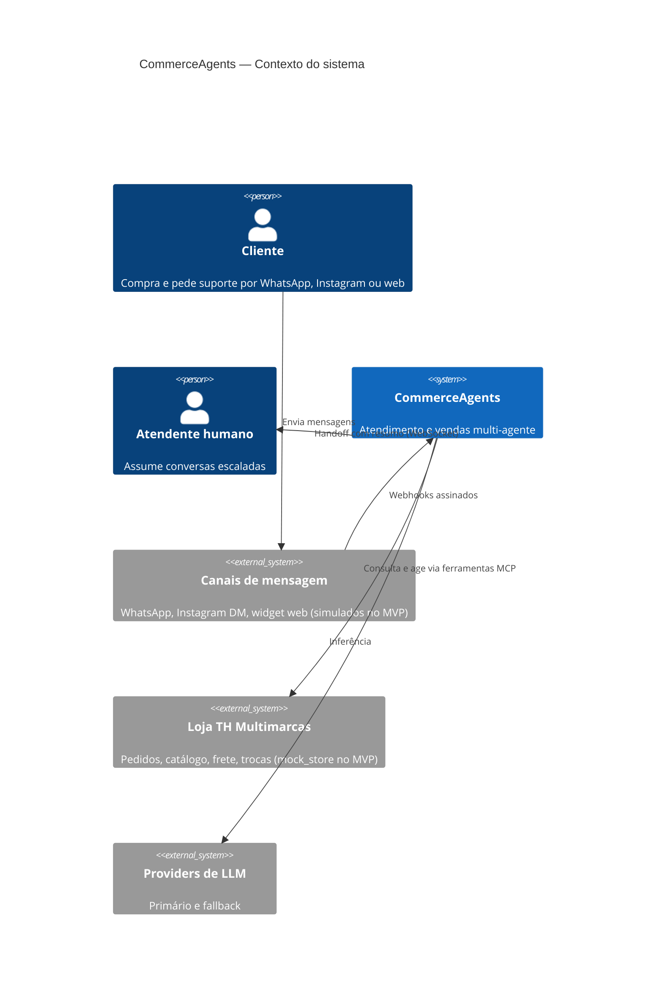

# C4 — Contexto

```mermaid
C4Context
    title CommerceAgents — Contexto do sistema
    Person(cliente, "Cliente", "Compra e pede suporte por WhatsApp, Instagram ou web")
    Person(atendente, "Atendente humano", "Assume conversas escaladas")
    System(ca, "CommerceAgents", "Atendimento e vendas multi-agente")
    System_Ext(canais, "Canais de mensagem", "WhatsApp, Instagram DM, widget web (simulados no MVP)")
    System_Ext(loja, "Loja TH Multimarcas", "Pedidos, catálogo, frete, trocas (mock_store no MVP)")
    System_Ext(llm, "Providers de LLM", "Primário e fallback")
    Rel(cliente, canais, "Envia mensagens")
    Rel(canais, ca, "Webhooks assinados")
    Rel(ca, loja, "Consulta e age via ferramentas MCP")
    Rel(ca, llm, "Inferência")
    Rel(ca, atendente, "Handoff com resumo (WebSocket)")
```
